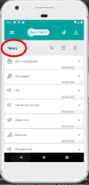
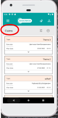
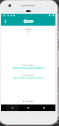

# *_План по проверке и автоматизации приложения «Мобильный хоспис»_* 

|

# _Приложение состоит и включает в себя_:

## Страницы и разделы имеющие следующий функционал:

### _Создание, редактирование, удаление, просмотр и поиск новостей.   Создание, редактирование, поиск, просмотр претензий, а так же создание и редактирование коментариев к ним._

## Cтраница загрузки приложения включает в себя: 

>  
>
> 

>
> * _Меняющуюся каждый раз при загрузке приложения_ **фоновую картинку**
> * _Крутящееся колесико_ **индикатора загрузки**
> * _Меняющуюся каждый раз при загрузке_ **цитату**
>  
>  
>  
>  
>  
>  
>  
>  
>  
>  
>  
>  

|

## Cтраницa "Authorization" включает в себя:

  

> 

>
> ### Форму с полями для заполнения и дальнейшей авторизации пользователя и входа в систему
> 
> * Поле _для ввода логина_ (**login**)
> * Поле _для ввода пароля_ (**password**)
> * Кнопка **"SIGN IN"**
>  
>  
>  
>  
>  
>  
>  
>  
>  
>  

|

## Cтраницa **_"Main"_** (Главная страница в которую пользователь попадает после авторизации) включает в себя:

 

> 

>
> ###  страница **_"Main"_** включает в себя:
>
> * _Верхняя часть придожения содержит_ **три кнопки** _которые доступны на каждой из страниц_ **"Claims", "News", "Main"** _а так же раздела_ **"Control panel**":
>
> * Кнопока (**_три полоски_**) _для раскрытия выпадающего списка со страницами, осуществления выбора и перехода на страницу_ (**_"About", "Claims", "News", "Main"_**)
> * Кнопка (**_иконка в виде человека_**) _для выхода пользователя из профиля_. 
> * Кнопка (**_иконка в виде бабочки_**) _для перехода пользователя на страницу с тематическими цитатами_.
>  
>  
>  
>  
>  
>  
>  

|

### Два выпадающих окна "News" и "Claims" которые включают в себя:

 

> 

>
> * "**_News_**" - _новостную сводку хосписа в виде ленты, из последних трех созданных новостей (отдельных блоков), которую есть возможность развернуть, свернуть_.
> * **Новостные блоки** _которые так же есть возможность развернуть, свернуть, для подробного просмотра_.
> * **Кнопку** _в виде названия_ "**_all news_**" _для перехода на страницу_ "**_News_**", _просмотра полной ленты новостных блоков_, а так же для доступа к функционалу страницы.
>
> * "**_Claims_**" - _информацию о претензиях в виде ленты из отдельных блоков, в которые есть возможность зайти при клике на них_, а так же доступа к функционалу в нем.
> * **Кнопку** _в виде названия_ "**_all Claims_**" _для перехода на страницу "Claims" просмотра полной ленты блоков с претензиями_, а так же для доступа к функционалу страницы.
> * **Кнопку** _для перехода в раздел создания претензии (_"Creating Claims"_) в виде_ "+"  
>  
>  
>  
>  
>  
>  

|

## Страница "**_News_**" включает в себя:

 

> 

>
> * **Ленту из блоков новостей** _с категориями, отсортированых по дате от самой ранней к самой поздней, блоки можно развернуть и свернуть для просмотра описания_.
> * **Кнопка** (**_иконка в виде двух стрелок указывающих вверх и вниз_**), _при нажатии лента новостей меняется, вверху списка появляются созданные раньше всех новости, внизу созданные позже всех_. 
> * **Кнопка** (**_три полоски с кружками_**), _при нажатии осуществляет переход в _"Filter news"_ для осуществления поиска новости, новостей с использованием фильтров содержащих поля:_   **категории и даты** _с использованием всплывающего окна с_ **календарем** _(управление происходит двумя кнопками "<", ">" смены месяца, года, а так же выбором числа месяца путем клика по нему) для поиска_ 
> * **Кнопка** _иконка в виде_ **блокнота с карандашом**) _при нажатии осуществляет переход в _"Control panel"_ для доспупа к функциям управления новостями_. 
>  
|

## Раздел **_"Filter news"_** включает в себя:

 

> 

>
> ### Форма с полями для использования фильтров:
> * **Поле** _для выбора и установки_ **Категории**
> * **Поле** _для выбора и установки_ **даты** _с использованием всплывающего окна с календарем (управление происходит двумя_ **кнопками "<", ">"** _смены_ **месяца, года**, _а так же выбором_ **числа** _месяца путем клика по нему) для поиска_
> * Кнопкa **FILTER** - _для активации поиска_ 
> * Кнопкa **CANCEL** - _для отмены поиска_
>  
>  
>  
>  
>  

|

## "Control panel" - включает в себя:

> 

>
> * **Кнопка** (**иконка в виде двух стрелок указывающих вверх и вниз**) _для смены сортировки новостей по датам (вверху списка появляются созданные раньше всех новости, внизу созданные позже всех)_.
> * **Кнопка** (**три полоски с кружками**) _для перехода в **"Filter news"** _и осуществления поиска новости, новостей с использованием фильтров при заполнении формы содержащей поля_: **категории, даты, статус**.
> * **Кнопка** (**_+_**)  _для перехода в раздел создания новости_ **"Creating News"**, _содержащий форму для заполнения с полями:   
     выбора_ **категории**, _ввода_ **названия**, _установки_ **даты публикации** _с использованием всплывающего окна с календарем.   Управление календарем происходит двумя кнопками "<", ">" для смены_ **месяца, года**, _а так же выбором_ **числа месяца** _путем клика по нему)_, 
 поле для установки **времени** _с использованием всплывающего окна с часами имеющими два типа, стрелочный: управление осуществляется переводом часовой и минутной стрелок и цифровой установка времени осуществляется при помощи ввода чисел в поля **"hour, minute"**,) и поле для **описания**, а так же работающую в постоянном режиме кнопку **"active"** для отображения статуса_ 
> * _Так же в_ **управление новостями** _есть возможность развернуть, свернуть каждый отдельно взятый новостной блок нажатием на него или стрелку вниз, возможность отредактировать отдельно взятую новость (нажать на кнопку **"блокнот с карандашем"** и перейти в раздел **"Editing News"**) или удалить новость (нажатием на кнопку с иконкой_ **"мусорный бачек**"). 
>  
> 

|

## Раздел **_"Creating News"_** включает в себя:

> 

>
> ### Форма с полями для заполнения:
> * **Поле** _для выбора и установки_ **Категории**
> * **Поле** _для ввода_ **Названия**
> * **Поле** _для выбора и установки_ **Даты** _с использованием всплывающего окна с_ **календарем** _управление происходит двумя_ **кнопками "<", ">"** _смены_ **месяца, года**, _а так же выбором_ **числа** _месяца путем клика по нему) для поиска_
> * **Поле** _для выбора и установки_ **Времени** _с использованием всплывающего окна с_ **часами** _имеющего два типа, стрелочный: управление осуществляется переводом_ **часовой и минутной** _стрелок и_ **цифровой** _установка времени осуществляется при помощи ввода чисел в поля_ **"hour, minute"**)
> * **Поле** _для ввода_ **Описания**
> * Кнопкa **SAVE** - _для сохранения новости_
> * Кнопкa **CANCEL** - _для сохранения новости_
>  
>  

## Страница "**_Claims_**" включает в себя: 

> 

>
> * **Информацию о всех претензиях** _в виде ленты из отдельных блоков (каждый блок содержит информацию о названии, исполнителе, этапы работы с претензией в виде статусов_ **"Open",  "In progress",  "executed", "canceled"**, дате, времени и коментариях), отсортированых по дате от самой ранней к самой поздней, в которые есть возможность зайти при клике на них, отредактировать жалобу (в разделе **"Editing Claims"** со статусом **"Open"**), взять в работу (со статусом **"Open"**), отбросить или взять в работу (со статусом **"In Progress"**) или добавить коментарий, коментарии (в претензии со всеми статусами)._
> * **Кнопка** (**три полоски с кружками**), _при нажатии осуществляет переход в_ **"Filtering"** _для поиска претензии, с использованием фильтров содержащих статусы_.
> * **Кнопка** "+" _для осуществления перехода в раздел_ **"Creating Claims"** _для создания претензии, содержащий форму с полями_:  
     _поле для ввода_ **названия**,   _поле с выбором из списка_ **исполнителя**,   _поле для установки_ **даты** _с использованием всплывающего окна с календарем. Управление происходит двумя кнопками "<", ">" для смены_ **месяца**, **года**, _а так же выбором_ **числа месяца** _путем клика по нему),  поле для установки_ **времени** _с использованием всплывающего окна с часами имеющими два типа,_ **стрелочный**: _управление осуществляется переводом часовой и минутной стрелок и_ **цифровой** _установка времени осуществляется при помощи ввода чисел в поля_ **"hour**, **minute**")  _поле для ввода описания_.
>  
>  

|

## Раздел **_"Filtering"_** включает в себя:

|

> 

>
> ### Oкно с чек-боксами статусов
> * Кнопка **"ОК"** _для активации поиска_
> * Кнопка "**CANCEL"** _для отмены поиска_
>  
>  
>  
>  
>  
>  
>  
>  
>  
>  
> 

 
|

## Раздел "**_Creating Claims_**" включает в себя:

> 

>
> Форма с полями для заполнения:
> * **Поле** _для ввода_ **Названия**
> * **Поле** _для выбора и установки_ **Исполнителя**
> * **Поле** _для выбора и установки_ **Даты** с использованием всплывающего окна с **календарем** _управление происходит двумя кнопками "<", ">" смены месяца, года, а так же выбором числа месяца путем клика по нему) для поиска_
> * **Поле** _для выбора и установки_ **Времени**  _с использованием всплывающего окна с_ **часами** _имеющего два типа, стрелочный: управление осуществляется переводом_ **часовой и минутной** _стрелок и_ **цифровой** _установка времени осуществляется при помощи ввода чисел в поля_ **"hour, minute"**)
> * **Поле** _для ввода_ **Описания**
> * Кнопкa **SAVE** - _для сохранения новости_
> * Кнопкa **CANCEL** - _для отмены сохранения новости_
>   
>  
>  

|

## Страница "**_About_**" включает в себя:

> 

>
> * **Кнопка назад "<"** _для осуществления перехода к предыдущей странице или разделу_.
> * _Информацию о_ **версии** _приложения_
> * _Две ссылки с информацией_ (**Privacy Policy, Terms of use**)
> * _Название_ **производителя** _и_ **год выпуска**       
>  
>  
>  
>  
>  
>  
>  

|

## Уровни тестирования: 

* _Модульное тестирование_ - проверка отдельно модулей **_"Authorization", "About", "Claims", "News", "Main", "Creating Claims", "Creating News", "Control panel", "Filter news", "Editing News", "Editing Claims", "Claims", " "Filtering", "Часы", "Календарь"_**

|

* _Интеграционное тестирование_ - проверка взаимодействия между компонентами (Переход со страницы **_"Authorization"_** на главную страницу, с главной страницы **_"Main"_** на страницу,
  **_"About", "Claims", "News", "Main"_**, переход из "страниц" в разделы "**_Creating Claims","Creating News","Control panel", "Filter news", "Editing News", "Editing Claims","Claims", "Filtering"_**, создание, удаление, редактирование, поиск новостей и претензий, создание и редактирование коментариев)   

## Виды тестирования:

* Функциональное тестирование
* Тестирование пользовательского интерфейса

## Перечень автоматизируемых сценариев:   

|

### Тестирование функциональности страницы загрузки

|

  
| **_id_** |       **_Название (title)_**       |                                                     **_Описание (Summary)_**                                                      | **_Приоритет (Priority)_** |                       Предусловие                        | **_Шаги (Steps to reproduce)_** |          **_Ожидаемый результат (Expected result)_**           | **_Комментарий к тесту_** |
|:--------:|:----------------------------------:|:---------------------------------------------------------------------------------------------------------------------------------:|:--------------------------:|:--------------------------------------------------------:|:-------------------------------:|:--------------------------------------------------------------:|:-------------------------:|
|    1     | Должен появится индекатор загрузки |                 В этом тест кейсе мы проверяем, что  во время загрузки приложения появляется индекатор загрузки)                  |            High            | Установить приложение на смартфон под управлением API 29 |     1.Запустить приложение      | 1.Индекатор загрузки крутится, на странице отображается цитата |                           |
|    2     | Должна появится надпись с цитатой  |    В этом тест кейсе мы проверяем, что  во время загрузки приложения появляется  цитата (цитаты при входе каждый раз меняются)    |            High            | Установить приложение на смартфон под управлением API 29 |     1.Запустить приложение      |           1.На странице загрузки присудствует цитата           |                           |
|    3     |      Должна появится картинка      | В этом тест кейсе мы проверяем, что  во время загрузки приложения появляется картинка (картинки каждый раз при загрузке меняются) |            High            | Установить приложение на смартфон под управлением API 29 |     1.Запустить приложение      |          1.На странице загрузки присудствует картинка          |                           |

### _Тестирование функциональности входа (авторизация), выхода из профиля_

|

 

| **_id_** |                               **_Название (title)_**                               |                                                                                      **_Описание (Summary)_**                                                                                       | **_Приоритет (Priority)_** |                              Предусловие                              |                                                                                                    **_Шаги (Steps to reproduce)_**                                                                                                     |                              **_Ожидаемый результат (Expected result)_**                              | **_Комментарий к тесту_** |
|:--------:|:----------------------------------------------------------------------------------:|:---------------------------------------------------------------------------------------------------------------------------------------------------------------------------------------------------:|:--------------------------:|:---------------------------------------------------------------------:|:--------------------------------------------------------------------------------------------------------------------------------------------------------------------------------------------------------------------------------------:|:-----------------------------------------------------------------------------------------------------:|:-------------------------:|
|    1     |                               Должен войти в систему                               |                                            В этом тест кейсе мы проверяем, что при вводе правильного логина и пароля пользователь входит в систему                                              |            High            | 1.Запустить приложение, дождаться загрузки страницы _"Authorization"_ |                                                         1.В поле "login" ввести валидный логин   2.В поле "password" ввести валидный пароль 3.Нажать на кнопку _"SIGN IN"_                                                         |                           1.Пользователь вошел в систему страница _(Main)_                            |                           |
|    2     | Должна появиться предупреждающая надпись при вводе неправильного логина или пароля |                    В этом тест кейсе мы проверяем, что при вводе неправильного логина или пароля пользователь не входит в систему, появляется надпись "Wrong login or password"                     |            High            | 1.Запустить приложение, дождаться загрузки страницы _"Authorization"_ |                                                     1.В поле "login" ввести валидный логин   2.В поле "password" ввести невалидный пароль   3.Нажать на кнопку _"SIGN IN"_                                                     |                   1.Появляется предупреждающая надпись _"Wrong login or password"_                    |                           |
|    3     |                              Должен выйти из профиля                               | В этом тест кейсе мы проверяем, что при нажатии на кнопку с иконкой _"человек"_ осуществляется осуществляется выход из профиля пользователя, пользователь оказывается на странице _"Authorization"_ |            High            |       1.Выполнить предусловия, шаги тест-кейса №1 (авторизация)       |                                                                          1.Нажать на кнопку с иконкой _"человек"_  2.Нажать на всплывшем окне _"Log out"_                                                                          | 1.Осуществел переход на страницу _"Authorization"_ перед пользователем поля для ввода логина и пароля |                           |
|    4     |  Должна появиться предупреждающая надпись при отсутствии ввода логина или пароля   |               В этом тест кейсе мы проверяем, что при отсутствии ввода логина или пароля пользователь не входит в систему, появляется надпись _"Login and password cannot be empty"_                |            High            | 1.Запустить приложение, дождаться загрузки страницы _"Authorization"_ | 1.В поле "login" ввести валидный логин   2.В поле "password" не заполнять   3.Нажать на кнопку _"SIGN IN"_ 1.В поле "login" не заполнять   2.В поле "password" ввести валидный пароль   3.Нажать на кнопку _"SIGN IN"_ |              1.Появляется предупреждающая надпись _"Login and password cannot be empty"_              |                           |
|    5     |   Должна появиться предупреждающая надпись при отсутствии ввода логина и пароля    |                В этом тест кейсе мы проверяем, что при отсутствии ввода логина и пароля пользователь не входит в систему, появляется надпись _"Login and password cannot be empty"_                 |            High            | 1.Запустить приложение, дождаться загрузки страницы _"Authorization"_ |                                                                 1.Поле "login" не заполнять   2.Поле "password" не заполнять   3.Нажать на кнопку _"SIGN IN"_                                                                  |              1.Появляется предупреждающая надпись _"Login and password cannot be empty"_              |                           |

### _Тестирование функционала переходов на страницы и в разделы_
|

| **_id_** |                                **_Название (title)_**                                 |                                                                                            **_Описание (Summary)_**                                                                                            | **_Приоритет (Priority)_** |                                                                                                           Предусловие                                                                                                           |                                                     **_Шаги (Steps to reproduce)_**                                                      |                **_Ожидаемый результат (Expected result)_**                 | **_Комментарий к тесту_** |
|:--------:|:-------------------------------------------------------------------------------------:|:--------------------------------------------------------------------------------------------------------------------------------------------------------------------------------------------------------------:|:--------------------------:|:-------------------------------------------------------------------------------------------------------------------------------------------------------------------------------------------------------------------------------:|:----------------------------------------------------------------------------------------------------------------------------------------:|:--------------------------------------------------------------------------:|:-------------------------:|
|    1     |                  Должен осуществляться переход на выбранную страницу                  |          В этом тест кейсе мы проверяем, что при нажатии на кнопку _"Action menu"_, должно появиться окно со списком страниц, при нажатии на выбранную страницу, должен осуществлятся переход на нее           |            High            |                                                                                    1.Выполнить предусловия, шаги тест-кейса №1 (авторизация)                                                                                    | 1.Нажать на кнопку _"Action menu"_  2. Выбрать из появившегося списка нужную страницу _"Main, Claims, News, About"_, кликнуть на нее | 1.Осуществлен переход на выбранную страницу _"Main, Claims, News, About"_  |                           |
|    2     |           Должен перейти на страницу _"LOVE IS ALL"_ при нажатии на кнопку            |                                       В этом тест кейсе мы проверяем, что при нажатии на кнопку с иконкой _"бабочки"_ осуществляется переход на страницу _"LOVE IS ALL"_                                       |            High            |                                                                                    1.Выполнить предусловия, шаги тест-кейса №1 (авторизация)                                                                                    |                                                 1.Нажать на кнопку с иконкой _"бабочки"_                                                 | 1.Осуществел переход на страницу _"LOVE IS ALL"_, название _"LOVE IS ALL"_ |                           |
|    3     |           Должен перейти на страницу _"Claims"_ при нажатии _"all claims"_            |                      В этом тест кейсе мы проверяем, что при нажатии на текстовую ссылку  _"all claims"_, происходит переход на страницу _"Claims"_ (страница _"Main" раздел "Claims"_ )                       |            High            |                                                                                    1.Выполнить предусловия, шаги тест-кейса №1 (авторизация)                                                                                    |                                               1.Нажать на текстовую ссылку  _"all claims"_                                               |    1. Осуществлен переход  на страницу _"Claims"_, название _"Claims"_     |                           |                                                                                                                                            
|    4     |             Должен перейти на страницу _"News"_ при нажатии _"all news"_              |                         В этом тест кейсе мы проверяем, что при нажатии на текстовую ссылку  _"all news"_, происходит переход на страницу _"News"_ (страница _"Main"  раздел "News"_ )                         |            High            |                                                                                    1.Выполнить предусловия, шаги тест-кейса №1 (авторизация)                                                                                    |                                                1.Нажать на текстовую ссылку  _"all news"_                                                |       1. Осуществлен переход на страницу _"News"_, название _"News"_       |                           |
|    5     |            Должен перейти в раздел создания претензии _"Creating Claims"_             |                                  В этом тест кейсе мы проверяем, что при нажатии на кнопку "+", происходит переход в _"Creating Claims"_ (страница _"Main" раздел "Claims"_ )                                  |            High            |                                                 1.Выполнить предусловия, шаги тест-кейса №1 (авторизация) (_авторизация_ -->  кнопка _"Action menu"_ -->  страница _"Сlaims"_)                                                  |                                                          1.Нажать на кнопку "+"                                                          | 1. Осуществлен переход в _"Creating Claims"_, название _"Creating Claims"_ |                           |
|    6     |                         Должен перейти в претензию _"Topic"_                          |                             В этом тест кейсе мы проверяем, что при нажатии  _"Topic"_ в разделе _claims_, пользователь переходит в _"Topic"_ (страница _"Main" раздел "Claims"_ )                             |            High            |                                                                                    1.Выполнить предусловия, шаги тест-кейса №1 (авторизация)                                                                                    |                                                  1.Нажать на _"Topic"_ в разделе claims                                                  |                     1. Осуществлен переход в _"Topic"_                     |                           |
|    7     |                Должен перейти в управление новостями _"Control panel"_                |             В этом тест кейсе мы проверяем, что при нажатии на кнопку с иконкой _"блокнот с карандашом"_ пользователь попадает в _"Control panel"_  (страница _"News"_ раздел _"Control panel"_ )              |            High            |                                               1.Выполнить предусловия, шаги тест-кейса №1 (авторизация)   (_авторизация_ -->  кнопка _"Action menu"_ -->  страница _"News"_)                                                |                                          1.Нажать на кнопку с иконкой _"блокнот с карандашом"_                                           |   1. Осуществлен переход в _"Control panel"_, название _"Control panel"_   |                           |
|    8     |                    Должен перейти в поиск новостей _"Filter news"_                    |                               В этом тест кейсе мы проверяем, что при нажатии на кнопку _"три полоски с кружками"_ пользователь попадает в _"Filter news"_  (страница _"News"_ )                               |            High            | 1.Выполнить предусловия, шаги тест-кейса №1 (авторизация), шаги тест-кейса №1 (Тестирование переходов) (_авторизация_ -->  кнопка _"Action menu"_  ) 2.В списке страниц _"Main, Claims, News, About"_ выбрать и нажать _"News"_ |                                              1.Нажать на кнопку _"три полоски с кружками"_                                               |     1. Осуществлен переход в _"Filter news"_, название _"Filter news"_     |                           |
|    9     |         Должен перейти в поиск новостей _"Filter news"_ из _"Control panel"_          |                 В этом тест кейсе мы проверяем, что при нажатии на кнопку _"три полоски с кружками"_ в  _"Control panel"_, пользователь попадает в _"Filter news"_ (раздел _"Control panel"_ )                 |            High            |                                              1.Выполнить предусловия, шаги тест-кейса №7 (_авторизация_ -->  кнопка _"Action menu"_ -->  страница _"News"_ --> _"Control panel"_)                                               |                                              1.Нажать на кнопку _"три полоски с кружками"_                                               |     1. Осуществлен переход в _"Filter news"_, название _"Filter news"_     |                           |
|    10    |    Должен перейти в раздел создания новости _"Creating News"_ из _"Control panel"_    |                            В этом тест кейсе мы проверяем, что при нажатии на кнопку "+" в  _"Control panel"_, пользователь попадает в _"Creating News"_ (раздел "Control panel" )                             |            High            |                                              1.Выполнить предусловия, шаги тест-кейса №7 (_авторизация_ -->  кнопка _"Action menu"_ -->  страница _"News"_ --> _"Control panel"_)                                               |                                                          1.Нажать на кнопку "+"                                                          |  1. Осуществлен переход в _"Creating News"_,  название _"Creating News"_   |                           |
|    11    | Должен перейти в раздел редактирования новостей _"Editing News"_ из _"Control panel"_ | В этом тест кейсе мы проверяем, что при нажатии на кнопку с иконкой _"блокнот с карандаошом"_ в новостном блоке, в _"Control panel"_, происходит переход в раздел _"Editing News"_ (раздел _"Control panel"_ ) |            High            |                                       1.Выполнить пункты тест-кейса №7 (_авторизация_ -->  кнопка _"Action menu"_ -->  _"страница News"_ --> кнопка с иконкой _"блокнот с карандаошом"_ )                                       |                          1.Выбрать новостной блок и нажать в нем на кнопку с иконкой _"блокнот с карандаошом"_                           |    1. Осуществлен переход в _"Editing News"_, название _"Editing News"_    |                           |
|    12    |                    Должен перейти в поиск претензий _"Filtering"_                     |          В этом тест кейсе мы проверяем что при нажатии на кнопку _"три полоски с кружками"_ на странице _"Claims"_ пользователь попадает в _"Filtering"_ (раздел _"Filtering"_ страницы _"Claims"_ )          |            High            |                                          1.Выполнить предусловие и пункты тест-кейса №1 2.Выбрать и нажать _"Claims"_  (_авторизация_ --> _"Action menu"_ -->  страница _"Claims"_                                          |                                              1.Нажать на кнопку _"три полоски с кружками"_                                               |       1.Осуществлен переход в _"Filtering"_, название _"Filtering"_        |                           |
|    13    |                          Должен перейти в _"Editing Claims"_                          |                     В этом тест кейсе мы проверяем что при нажатии на кнопку _"блокнот с карандаошом"_ в _"Claims"_ пользователь попадает в _"Editing Claims"_ (раздел _"Editing Claims"_)                     |            High            |                                         1.Выполнить предусловие и пункты тест-кейса №1 2.Выбрать и нажать _"Claims"_  (_авторизация_ --> _"Action menu"_ -->  страница _"Claims"_)                                          |           1.Найти и кликнуть на претензию (со статусом _"Open"_) для входа в нее 2.Нажать на кнопку _"блокнот с карандаошом"_            |  1.Осуществлен переход в _"Editing Claims"_ , название _"Editing Claims"_  |                           |

### _Тестирование функционала развертывания, свертывания блоков и выпадающих списков_
|

| **_id_** |                                  **_Название (title)_**                                   |                                                                                        **_Описание (Summary)_**                                                                                         | **_Приоритет (Priority)_** |                                                                                      Предусловие                                                                                       |                                      **_Шаги (Steps to reproduce)_**                                       |                                    **_Ожидаемый результат (Expected result)_**                                     | **_Комментарий к тесту_** |
|---------:|:-----------------------------------------------------------------------------------------:|:-------------------------------------------------------------------------------------------------------------------------------------------------------------------------------------------------------:|:--------------------------:|:--------------------------------------------------------------------------------------------------------------------------------------------------------------------------------------:|:----------------------------------------------------------------------------------------------------------:|:------------------------------------------------------------------------------------------------------------------:|:-------------------------:|
|        1 |       Должна развернуться, свернуться новостная лента с новостными блоками _"News"_       |                  В этом тест кейсе мы проверяем, что при нажатии на кнопку с выпадающим окном, разворачивается, сварачивается лента с блоками новостей в _"News"_ (страница _"Main"_ )                  |            High            |                                                               1.Выполнить предусловия, шаги тест-кейса №1 (авторизация)                                                                |                         1.Нажать на кнопку развернуть, свернуть в разделе _"News"_                         | 1.Под блоком _"News"_ разворачивается, сварачивается новостная лента с блоками _"News"_, лента с блоками _"Topic"_ |                           |
|        2 |                             Должно появиться описание новости                             |  В этом тест кейсе мы проверяем, что при нажатии на кнопку _"свернуть, развернуть"_ в новостном блоке, разворачивается, сварачивается (появляется) описание новости (страница _"Main" раздел "News"_ )  |            High            |                                                               1.Выполнить предусловия, шаги тест-кейса №1 (авторизация)                                                                |             1.Нажать на кнопку _"свернуть, развернуть"_ в новостном блоке, в разделе _"News"_              |                  1.Новостной блок, в разделе _"News"_ , раскрывается, появляется описание новости                  |                           |
|        3 | Должна развернуться, свернуться лента с блоками претензий _"Topic"_ в разделе _"Claims"_  |                 В этом тест кейсе мы проверяем, что при нажатии на кнопку с выпадающим окном, разворачивается, сварачивается лента с блоками "Topic" в _"Claims"_ (страница _"Main"_ )                  |            High            |                                                               1.Выполнить предусловия, шаги тест-кейса №1 (авторизация)                                                                |                        1.Нажать на кнопку развернуть, свернуть в разделе _"Claims"_                        |        1.Под блоком _"Claims"_ разворачивается, сварачивается лента с требованиями в виде блоков  _"Topic"_        |                           |
|        4 |          Должно появится описание новости в новостном блоке в _"Control panel"_           |      В этом тест кейсе мы проверяем, что при нажатии на кнопку _"стрелка вниз"_ с выпадающим окном, появляется описание в новостном блоке находясь в _"Control panel"_ (раздел _"Control panel"_)       |            High            | 1.Выполнить предусловия, шаги тест-кейса №7 (тестирование переходов) (_авторизация_ -->  кнопка _"Action menu"_ --> страница _"News"_ --> кнопка с иконкой _"блокнот с карандаошом"_ ) |                        1.Выбрать новостной блок, нажать на кнопку _"стрелка вниз"_                         |          1.В разделе _"Control panel"_ новостной блок растягивается, пользователь видит описание новости           |                           |
|        5 |          Должно появится описание новости в новостном блоке на странице _"News"_          |         В этом тест кейсе мы проверяем, что при нажатии на кнопку _"стрелка вниз"_ с выпадающим окном, появляется описание в новостном блоке находясь на странице _"News"_ (страница _"News"_)          |            High            |                                    1.Выполнить предусловия, шаги тест-кейса №1 (тестирование переходов) (_авторизация_ -->  кнопка _"Action menu"_)                                    | 1.Выбрать в появившемся списке и нажать на _"News"_ 2.В новостном блоке, нажать на кнопку _"стрелка вниз"_ |                        1.Новостной блок растягивается, пользователь видит описание новости                         |                           |

### _Тестирование функционала при заполнении форм в разделах "Creating News", "Creating Claims", "Editing News", "Comment", "Editing Claims"_ 
|

| **_id_** |                                             **_Название (title)_**                                             |                                                                                                             **_Описание (Summary)_**                                                                                                              | **_Приоритет (Priority)_** |                                                                                             Предусловие                                                                                              |                                                                                                                                                                                      **_Шаги (Steps to reproduce)_**                                                                                                                                                                                       |                                       **_Ожидаемый результат (Expected result)_**                                       | **_Комментарий к тесту_** |
|:--------:|:--------------------------------------------------------------------------------------------------------------:|:-------------------------------------------------------------------------------------------------------------------------------------------------------------------------------------------------------------------------------------------------:|:--------------------------:|:----------------------------------------------------------------------------------------------------------------------------------------------------------------------------------------------------:|:----------------------------------------------------------------------------------------------------------------------------------------------------------------------------------------------------------------------------------------------------------------------------------------------------------------------------------------------------------------------------------------------------------:|:-----------------------------------------------------------------------------------------------------------------------:|---------------------------|
|    1     |                                  Не должны вводиться буквы _"Creating News"_                                   |                                           В этом тест кейсе мы проверяем, что поля _"Title"_, _"Discription"_  незаполняются нелатинскими буквами в форме _"Creating News"_ (раздел _"Creating News"_)                                            |            High            |                         1.Выполнить предусловия, шаги тест-кейса №10 (_авторизация_ -->  кнопка _"Action menu"_ -->  страница _"News"_ --> _"Control panel"_ --> кнопка "+")                         |                                                                                                                                              1.В поле _"Title"_ ввести русские буквы, 2.В поле _"Description"_ ввести русские буквы 3.Нажать кнопку _"SAVE"_                                                                                                                                               |                                    1.Поля _"Title"_, _"Description"_ не заполняются                                     |                           |
|    2     |                                Не должны вводвиться буквы  _"Creating Claims"_                                 |                                              В этом тест кейсе мы проверяем, что поля _"Title", "Discription"_ незаполняются нелатинскими  в форме _"Creating Claims"_  (раздел _"Creating Claims"_)                                              |            High            |            1.Выполнить предусловия, шаги тест-кейса №5 (тестирование переходов) (_авторизация_ -->  кнопка _"Action menu"_ -->  страница _"Claims"_ --> _"Control panel"_ --> кнопка "+")            |                                                                                                                                              1.В поле _"Title"_ ввести русские буквы, 2.В поле _"Description"_ ввести русские буквы 3.Нажать кнопку _"SAVE"_                                                                                                                                               |                                    1.Поля _"Title"_, _"Description"_ не заполняются                                     |                           |         
|    3     |                                  Не должны вводиться буквы  _"Editing News"_                                   |                                                 В этом тест кейсе мы проверяем, что поля _"Title", "Discription"_ незаполняются нелатинскими  в форме _"Editing News"_ (раздел _"Editing News"_ )                                                 |            High            |                   1.Выполнить предусловия, шаги тест-кейса №11 (_авторизация_ -->  кнопка _"Action menu"_ -->  _"страница News"_ --> кнопка с иконкой _"блокнот с карандаошом"_ )                    |                                                                                                                                              1.В поле _"Title"_ ввести русские буквы, 2.В поле _"Description"_ ввести русские буквы 3.Нажать кнопку _"SAVE"_                                                                                                                                               |                                    1.Поля _"Title"_, _"Description"_ не заполняются                                     |                           |
|    3     |                                 Не должны вводиться буквы  _"Editing Claims"_                                  |                                               В этом тест кейсе мы проверяем, что поля _"Title", "Discription"_ незаполняются нелатинскими  в форме _"Editing Claims"_ (раздел _"Editing Claims"_ )                                               |            High            |  1.Выполнить предусловия, шаги тест-кейса №13 (_авторизация_ -->  кнопка _"Action menu"_ -->  _"страница Claims"_ --> _"Claims" с статусом "Open"_ --> кнопка с иконкой _"блокнот с карандаошом"_ )  |                                                                                                                                              1.В поле _"Title"_ ввести русские буквы, 2.В поле _"Description"_ ввести русские буквы 3.Нажать кнопку _"SAVE"_                                                                                                                                               |                                    1.Поля _"Title"_, _"Description"_ не заполняются                                     |                           |
|    3     |                                     Не должны вводиться буквы  _"Comment"_                                     |                                                                    В этом тест кейсе мы проверяем, что поле _"Comment"_ незаполняются нелатинскими буквами (раздел _"Topic"_ )                                                                    |            High            |                                            1.Выполнить предусловия, шаги тест-кейса №6 (тестирование переходов) (_авторизация_ --> кликнуть на _"Topic"_)                                            |                                                                                                                                                                     1.В поле _"Comment"_ ввести русские буквы 2.Нажать кнопку _"SAVE"_                                                                                                                                                                     |                                            1.Полe _"Comment"_ не заполняeтся                                            |                           |
|    4     |                            Должны вводиться буквы, цифры, символы _"Creating News"_                            |                                     В этом тест кейсе мы проверяем, что поля _"Title", "Description"_ заполняются латинскими буквами, цифрами, символами в форме _"Creating News" (раздел _"Creating News"_)                                      |            High            |                         1.Выполнить предусловия, шаги тест-кейса №10 (_авторизация_ -->  кнопка _"Action menu"_ -->  страница _"News"_ --> _"Control panel"_ --> кнопка "+")                         |                                                                                                     1.В поле _"Title"_ ввести слова английскими буквами, использовать цифры и символы 2.В поле _"Description"_ ввести слова английскими буквами, использовать цифры и символы 3.Нажать кнопку _"SAVE"_                                                                                                     |                     1.Поле _"Title"_ заполнено "()Hello world/!", _"Description"_ заполнено "@@@@@"                     |                           |
|    5     |                          Должны вводиться буквы , цифры, символы _"Creating Claims"_                           |                                  В этом тест кейсе мы проверяем, что поля _"Title", "Description"_ заполняются латинскими буквами, цифрами, символами в форме  _"Creating Claims"_ (раздел _"Creating Claims"_)                                   |            High            |                       1.Выполнить предусловия, шаги тест-кейса №5 (тестирование переходов) (_авторизация_ -->  кнопка _"Action menu"_ -->  страница _"Claims"_ --> кнопка "+")                       |                                                                                                     1.В поле _"Title"_ ввести слова английскими буквами, использовать цифры и символы 2.В поле _"Description"_ ввести слова английскими буквами, использовать цифры и символы 3.Нажать кнопку _"SAVE"_                                                                                                     |                     1.Поле _"Title"_ заполнено "()Hello world/!", _"Description"_ заполнено "@@@@@"                     |                           |
|    5     |                              Должны вводиться буквы , цифры, символы _"Comment"_                               |                                                             В этом тест кейсе мы проверяем, что полe _"Comment" заполняeтся латинскими буквами, цифрами, символами (раздел _"Topic"_)                                                             |            High            |                                            1.Выполнить предусловия, шаги тест-кейса №5 (тестирование переходов) (_авторизация_ --> кликнуть на _"Topic"_)                                            |                                                                                                                                                1.В поле _"Comment"_ ввести слова английскими буквами, использовать цифры и символы 2.Нажать кнопку _"SAVE"_                                                                                                                                                |                            1.В _"Topic"_ появился коментарий заполненый _"()Hello world/!"_                             |                           |
|    6     |                                    Не должно вводвиться больше 50 символов                                     |                                                    В этом тест кейсе мы проверяем, что в поле _"Title", можно ввести не больше 50 символов в _"Creating Claims"_ (раздел _"Creating Claims"_)                                                     |            High            |                       1.Выполнить предусловия, шаги тест-кейса №5 (тестирование переходов) (_авторизация_ -->  кнопка _"Action menu"_ -->  страница _"Claims"_ --> кнопка "+")                       |                                                                                                                                                                                    1.В поле _"Title"_ ввести 51 символ                                                                                                                                                                                     |                                         1.Поле _"Title"_ заполнено 50 символов                                          |                           |
|    6     |                                      Должно вводвиться меньше 50 символов                                      |                                                    В этом тест кейсе мы проверяем, что в поле _"Title", можно ввести не больше 50 символов в _"Creating Claims"_ (раздел _"Creating Claims"_)                                                     |            High            |                       1.Выполнить предусловия, шаги тест-кейса №5 (тестирование переходов) (_авторизация_ -->  кнопка _"Action menu"_ -->  страница _"Claims"_ --> кнопка "+")                       |                                                                                                                                                                                   1.В поле _"Title"_ ввести 49 символов                                                                                                                                                                                    |                                         1.Поле _"Title"_ заполнено 50 символов                                          |                           |
|    6     |                                         Должно вводвиться 50 символов                                          |                                                    В этом тест кейсе мы проверяем, что в поле _"Title", можно ввести не больше 50 символов в _"Creating Claims"_ (раздел _"Creating Claims"_)                                                     |            High            |                       1.Выполнить предусловия, шаги тест-кейса №5 (тестирование переходов) (_авторизация_ -->  кнопка _"Action menu"_ -->  страница _"Claims"_ --> кнопка "+")                       |                                                                                                                                                                                   1.В поле _"Title"_ ввести 50 символов                                                                                                                                                                                    |                                         1.Поле _"Title"_ заполнено 50 символов                                          |                           |
|    7     |                            Должны вводиться буквы, цифры, символы _"Editing News"_                             |                                     В этом тест кейсе мы проверяем, что поля _"Title", "Description"_ заполняются латинскими буквами, цифрами, символами в форме  _"Editing News"_ (раздел _"Editing News"_ )                                     |            High            |                   1.Выполнить предусловия, шаги тест-кейса №11 (_авторизация_ -->  кнопка _"Action menu"_ -->  _"страница News"_ --> кнопка с иконкой _"блокнот с карандаошом"_ )                    |                                                                                              1.В поле _"Title"_ ввести ввести слова английскими буквами, использовать цифры и символы 2.В поле _"Description"_ ввести ввести слова английскими буквами, использовать цифры и символы 3.Нажать кнопку _"SAVE"_                                                                                              |                     1.Поле _"Title"_ заполнено "()Hello world/!", _"Description"_ заполнено "@@@@@"                     |                           |
|    8     |              Должно появится предупреждающее сообщение в "Creating News" при незаполненных полях               |                       В этом тест кейсе мы проверяем, что при незаполненном, незаполненных полях появляется предупреждающее сообщение _"fill empty fields"_ , после нажатия на кнопку _"SAVE"_  (раздел _"Creating News"_)                        |            High            |                         1.Выполнить предусловия, шаги тест-кейса №10 (_авторизация_ -->  кнопка _"Action menu"_ -->  страница _"News"_ --> _"Control panel"_ --> кнопка "+")                         |                                                                                                                                                                                          1.Нажать кнопку _"SAVE"_                                                                                                                                                                                          |                              1.Появляется предупреждающее сообщение _"fill empty fields"_                               |                           |
|    9     | Должно появится окно с предупреждающим сообщением и кнопкой _"ок"_ при незаполненных полях в "Creating Claims" |            В этом тест кейсе мы проверяем, что при незаполненном, незаполненных полях появится окно с предупреждающим сообщением _"fill empty fields"_ и кнопкой _"ок"_, после нажатия на кнопку _"SAVE"_ (раздел _"Creating Claims"_)            |            High            |                       1.Выполнить предусловия, шаги тест-кейса №5 (тестирование переходов) (_авторизация_ -->  кнопка _"Action menu"_ -->  страница _"Claims"_ --> кнопка "+")                       |                                                                                                                                                                                          1.Нажать кнопку _"SAVE"_                                                                                                                                                                                          |                              1.Появится окно с предупреждающим сообщением и кнопкой _"ок"_                              |                           |
|    10    |               Должно появится предупреждающее сообщение при незаполненных полях в "Еditing News"               |               В этом тест кейсе мы проверяем, что при удалении и незаполнении поля _"Title", "Description"_ появляется предупреждающее сообщение _"fill empty fields"_, после нажатия на кнопку _"SAVE"_ (раздел _"Editing News"_ )               |            High            |                   1.Выполнить предусловия, шаги тест-кейса №11 (_авторизация_ -->  кнопка _"Action menu"_ -->  _"страница News"_ --> кнопка с иконкой _"блокнот с карандаошом"_ )                    |                                                                                                                                                                             1.Очистить поле _"Title"_ 2.Нажать кнопку _"SAVE"_                                                                                                                                                                             |                              1.Появляется предупреждающее сообщение _"fill empty fields"_                               |                           |
|    11    |                 Должны появится предупреждающие иконки в незаполненном поле в "Creating News"                  |                     В этом тест кейсе мы проверяем, что в незаполненных  поле, полях, появляется _красный восклецательный знак в круге_, цвета красного цвета, после нажатия на кнопку _"SAVE"_  (раздел _"Creating Claims"_)                     |            High            |                         1.Выполнить предусловия, шаги тест-кейса №10 (_авторизация_ -->  кнопка _"Action menu"_ -->  страница _"News"_ --> _"Control panel"_ --> кнопка "+")                         |                                                                                                                                                                    1.В поле _"Title"_ ввести "()Hello world/!" 2.Нажать кнопку _"SAVE"_                                                                                                                                                                    |                       1.В поле _"Description"_ появилась иконка _"восклецательный знак в круге"_                        |                           |
|    12    |                Должны появится предупреждающие иконки в незаполненном поле в "Creating Claims"                 |                      В этом тест кейсе мы проверяем, что в незаполненных  поле, полях, появляется _красный восклецательный знак в круге_, цвета красного цвета, после нажатия на кнопку _"SAVE"_  (раздел _"Creating News"_)                      |            High            |                       1.Выполнить предусловия, шаги тест-кейса №5 (тестирование переходов) (_авторизация_ -->  кнопка _"Action menu"_ -->  страница _"Claims"_ --> кнопка "+")                       |                                                                                                                                                                 1.В поле _"Description"_ ввести "()Hello world/!" 2.Нажать кнопку _"SAVE"_                                                                                                                                                                 |                          1.В поле _"Title"_ появилась иконка _"восклецательный знак в круге"_                           |                           |
|    13    |                  Должны появится предупреждающие иконки в незаполненном поле в "Еditing News"                  |                      В этом тест кейсе мы проверяем, что при удалении и незаполнении поля _"Title", "Discription"_ в _"Editing News"_ появляется предупреждающее сообщение _"fill empty fields"_  (раздел _"Editing News"_ )                      |            High            |                   1.Выполнить предусловия, шаги тест-кейса №11 (_авторизация_ -->  кнопка _"Action menu"_ -->  _"страница News"_ --> кнопка с иконкой _"блокнот с карандаошом"_ )                    |                                                                                                                                                                    1.Очистить поле _"Title"_, _"Description"_ 2.Нажать кнопку _"SAVE"_                                                                                                                                                                     |                 1.В полях _"Title"_, _"Description"_ появились иконки _"восклецательный знак в круге"_                  |                           |
|    13    |          Должно появится предупреждающие сообщение при заполнении поля _"Category"_ в "Еditing News"           | В этом тест кейсе мы проверяем, что поле _"Category"_ в _"Editing News"_ заполненное категорией не входящей в список не может быть сохранено, появляется предупреждающее сообщение _"Saving failed. Try again later"_  (раздел _"Editing News"_ ) |            High            |                   1.Выполнить предусловия, шаги тест-кейса №11 (_авторизация_ -->  кнопка _"Action menu"_ -->  _"страница News"_ --> кнопка с иконкой _"блокнот с карандаошом"_ )                    |                                                                                                                                                     1.Кликнуть на поле _"Category"_, ввести в поле слово на английском языке 2.Нажать кнопку _"SAVE"_                                                                                                                                                      |                        1.Появляется предупреждающее сообщение _"Saving failed. Try again later"_                        |                           |
|    14    |              Должна появиться предупреждающая надпись при незаполненном поле "comment" в "Topic"               |                           В этом тест кейсе мы проверяем, что при незаполнении поля _"comment"_, после нажатия на кнопку _"SAVE"_, появляется предупреждающая надпись _"The field cannot be empty"_  (раздел _"Topic"_)                           |            High            |                                            1.Выполнить предусловия, шаги тест-кейса №6 (тестирование переходов) (_авторизация_ --> кликнуть на _"Topic"_)                                            |                                                                                                                                                                       1.В поле _"add coment"_ нажать на "+" 2.Нажать кнопку _"SAVE"_                                                                                                                                                                       |                           1.Появляется предупреждающая надпись _"The field cannot be empty"_                            |                           |
|    15    |                           Должно появиться окно с часами при клике по полю _"Time"_                            |                                                                   В этом тест кейсе мы проверяем, что при клике по полю _"Time"_ появляется окно с _часами (стрелочного типа)_                                                                    |            High            |                         1.Выполнить предусловия, шаги тест-кейса №10 (_авторизация_ -->  кнопка _"Action menu"_ -->  страница _"News"_ --> _"Control panel"_ --> кнопка "+")                         |                                                                                                                                                                                        1.Кликнуть по полю _"Time"_                                                                                                                                                                                         |                                       1.Появляется окно с часами стрелочного типа                                       |                           |
|    16    |                         Должно появиться окно с календарем при клике по полю _"Date"_                          |                                                                           В этом тест кейсе мы проверяем, что при клике по полю _"Date"_ появляется окно с _календарем_                                                                           |            High            |                       1.Выполнить предусловия, шаги тест-кейса №5 (тестирование переходов) (_авторизация_ -->  кнопка _"Action menu"_ -->  страница _"Claims"_ --> кнопка "+")                       |                                                                                                                                                                                        1.Кликнуть по полю _"Date"_                                                                                                                                                                                         |                                             1.Появляется окно с календарем                                              |                           |
|    17    |                   Должно появиться окно с календарем при клике по полю _"Publication date"_                    |                                                                     В этом тест кейсе мы проверяем, что при клике по полю _"Publication date"_ появляется окно с _календарем_                                                                     |            High            |                   1.Выполнить предусловия, шаги тест-кейса №11 (_авторизация_ -->  кнопка _"Action menu"_ -->  _"страница News"_ --> кнопка с иконкой _"блокнот с карандаошом"_ )                    |                                                                                                                                                                                  1.Кликнуть по полю _"Publication date"_                                                                                                                                                                                   |                                             1.Появляется окно с календарем                                              |                           |
|    18    |                             Должен появиться список категорий в _"Creating News"_                              |                                           В этом тест кейсе мы проверяем, что при нажатии на поле _"Category"_ с выпадающим списком, появляется список доступных категорий  (раздел _"Creating News"_)                                            |            High            |     1.Выполнить предусловия, шаги тест-кейса №7 (тестирование переходов) (_авторизация_ -->  кнопка _"Action menu"_ --> страница _"News"_ --> кнопка с иконкой _"блокнот с карандаошом"_ --> "+"     |                                                                                                                                                                                      1.Кликнуть по полю _"Category"_                                                                                                                                                                                       |                 1.Под полем _"Category"_ появляется список доступных для выбора пользователю категорий                  |                           |
|    19    |                           Должен появиться список исполнителей в _"Creating Claims"_                           |                                         В этом тест кейсе мы проверяем, что при нажатии на поле _"Executor"_ с выпадающим списком, появляется список доступных исполнителей  (раздел _"Creating Claims"_)                                         |            High            |            1.Выполнить предусловия, шаги тест-кейса №5 (тестирование переходов) (_авторизация_ -->  кнопка "+" раздел _"Claims"_ или _"Action menu"_ --> страница _"Claims"_ кнопка "+")             |                                                                                                                                                                                      1.Кликнуть по полю _"Executor"_                                                                                                                                                                                       |                1.Под полем _"Executor"_ появляется список доступных для выбора пользователю исполнителей                |                           |
|    20    |                              Должен появиться список категорий в _"Filter News"_                               |                                            В этом тест кейсе мы проверяем, что при нажатии на поле _"Category"_ с выпадающим списком, появляется список доступных категорий  (раздел _"Filter News"_ )                                            |            High            | 1.Выполнить предусловия, шаги тест-кейса №9 (тестирование переходов) (_авторизация_ -->  кнопка _"Action menu"_ -->  страница _"News"_ --> _"Control panel"_ --> кнопкa _"три полоски с кружками"_ ) |                                                                                                                                                                                      1.Кликнуть по полю _"Category"_                                                                                                                                                                                       |                 1.Под полем _"Category"_  появляется список доступных для выбора пользователю категорий                 |                           |
|    21    |             Должно появиться окно с календарем при клике по полю _"DD.MM.YYYY"_  в _"Filter News"_             |                                                         В этом тест кейсе мы проверяем, что при нажатии на поле _"DD.MM.YYYY"_ появляется окно с _календарем_   (раздел _"Filter News"_ )                                                         |            High            | 1.Выполнить предусловия, шаги тест-кейса №9 (тестирование переходов) (_авторизация_ -->  кнопка _"Action menu"_ -->  страница _"News"_ --> _"Control panel"_ --> кнопкa _"три полоски с кружками"_ ) |                                                                                                                                                                                     1.Кликнуть по полю _"DD.MM.YYYY"_                                                                                                                                                                                      |                                             1.Появляется окно с календарем                                              |                           |
|    22    |                                    Установка категории в поле _"Category"_                                     |                                                                    В этом тест кейсе мы проверяем выбор и установку категории в поле _"Category"_ (раздел _"Creating News"_ )                                                                     |            High            |                                                          1.Выполнить предусловия, шаги тест-кейса №18 (Тестирование функциональности форм)                                                           |                                                                                                                                                                               1.Выбрать категорию из списка, кликнуть на нее                                                                                                                                                                               |                                   1.Поле _"Category"_  заполнено выбраной категорией                                    |                           |
|    23    |                                   Установка исполнителя в поле _"Executor"_                                    |                                                                  В этом тест кейсе мы проверяем выбор и установку исполнителя в поле _"Executor"_  (раздел _"Creating Claims"_)                                                                   |            High            |                                                          1.Выполнить предусловия, шаги тест-кейса №19 (Тестирование функциональности форм)                                                           |                                                                                                                                                                             1.Выбрать исполнителя из списка, кликнуть на него                                                                                                                                                                              |                                  1.Поле _"Executor"_ заполнено выбранным исполнителем                                   |                           |
|    24    |                        Должно установиться време в поле _"Time"_ в _"Creating Claims"_                         |                                                                      В этом тест кейсе мы проверяем выбор и установку времени в поле _"Time"_  (раздел _"Creating Claims"_)                                                                       |            High            |                                                          1.Выполнить предусловия, шаги тест-кейса №15 (Тестирование функциональности форм)                                                           |                                                                                                                                                            1.Перевести часовую стрелку на нужный час, минутную на нужную минуту 2.Нажать _"ок"_                                                                                                                                                            |             1.Поле _"Time"_ заполнено выбранным временем (время соответствует выставленному пользователем)              |                           |
|    25    |                         Должна установиться дата в поле _"Date"_ в _"Creating Claims"_                         |                                                                        В этом тест кейсе мы проверяем выбор и установку даты в поле _"Date"_ (раздел _"Creating Claims"_ )                                                                        |            High            |                                                          1.Выполнить предусловия, шаги тест-кейса №16 (Тестирование функциональности форм)                                                           |                                                                                                                                                                          1.Выбрать число в календаре, месяц, год 2.Нажать _"ок"_                                                                                                                                                                           |                                        1.Поле _"Date"_ заполнено выбранной датой                                        |                           |
|    25    |                       Должна установиться дата в полях _"DD.MM.YYYY"_ в _"Filter News"_                        |                                                                       В этом тест кейсе мы проверяем выбор и установку дат в поля _"DD.MM.YYYY"_ (раздел _"Filter News"_ )                                                                        |            High            |                                                           1.Выполнить предусловия, шаги тест-кейса №8 (Тестирование функционала переходов)                                                           |                                                                                                        1.Кликнуть на левое поле _"DD.MM.YYYY"_ выбрать число в календаре, месяц, год 2.Нажать _"ок"_ 3.Кликнуть на правое поле _"DD.MM.YYYY"_ выбрать число в календаре, месяц, год 2.Нажать _"ок"_                                                                                                        |                                    1.Поля _"DD.MM.YYYY"_ заполнены выбранными датами                                    |                           |
|    26    |                         Должно установиться време в поле _"Time"_ в _"Creating News"_                          |                                                                       В этом тест кейсе мы проверяем выбор и установку времени в поле _"Time"_ (раздел _"Creating News"_ )                                                                        |            High            |                                                          1.Выполнить предусловия, шаги тест-кейса №15 (Тестирование функциональности форм)                                                           |                                                                                                                                                        1.Перевести часовую стрелку на нужный час, минутную стрелку на нужную минуту 2.Нажать _"ок"_                                                                                                                                                        |             1.Поле _"Time"_ заполнено выбранным временем (время соответствует выставленному пользователем)              |                           |
|    27    |                    Должна установиться дата в поле _"Publicanion date"_ в _"Creating News"_                    |                                                                  В этом тест кейсе мы проверяем выбор и установку даты в поле _"Publicanion date"_ (раздел _"Creating News"_  )                                                                   |            High            |                                                          1.Выполнить предусловия, шаги тест-кейса №17 (Тестирование функциональности форм)                                                           |                                                                                                                                                                           1.Выбрать число в календаре, месяц, год 2.Нажать "ок"                                                                                                                                                                            |                                  1.Поле _"Publicanion date"_ заполнено выбранной датой                                  |                           |
|    28    |                                           Должен поменятся вид часов                                           |                                                        В этом тест кейсе мы проверяем, что при нажатии на кнопку с иконкой _"клавиатура"_ меняется вид часов (раздел _"Creating News"_  )                                                         |            High            |                                                          1.Выполнить предусловия, шаги тест-кейса №15 (Тестирование функциональности форм)                                                           |                                                                                                                                                                                1.Нажать на кнопку с иконкой _"клавиатура"_                                                                                                                                                                                 | 1.Вид часов со стрелками поменялся на вид цифровых часов с возможностью установки времени через поля _"hour", "minute"_ |                           |
|    29    |                                  Должно установиться време вид часов цифровой                                  |                                                                В этом тест кейсе мы проверяем установку времени заполняя поля _"hour", "minute"_ (раздел _"цифровой вид часов"_  )                                                                |            High            |                                                      1.Выполнить предусловия, шаги тест-кейса №24, 26, 28 (Тестирование функциональности форм)                                                       | 1.В поле _"hour"_ ввести число не превышающее 23 (например от 0 до 23) 2.В поле _"minute"_ ввести число не превышающее 59  (например от 0 до 59) 3.Нажать кнопку _"ок"_ 4.Кликнуть поле _"Time"_ 5.Нажать на кнопку с иконкой "клавиатура" 6.В поле _"hour"_ ввести число не превышающее 24  (например от 0 до 24 7.В поле _"minute"_ ввести число не превышающее 00 (например  00) 8.Нажать кнопку _"ок"_ |                    1.Поле для установки времени заполненно введенными данными в часах цифрового типа                    |                           |

### Тестирование  функционала создания, удаления, редактирования, отмены действий создания, удаления, редактирования, новостей, коментариев и претензий_ 

|

| **_id_** |                            **_Название (title)_**                            |                                                                                                                                                                          **_Описание (Summary)_**                                                                                                                                                                          | **_Приоритет (Priority)_** |                                                                                                                                  Предусловие                                                                                                                                  |                                                                                                                                                                                                                                                         **_Шаги (Steps to reproduce)_**                                                                                                                                                                                                                                                          |                                              **_Ожидаемый результат (Expected result)_**                                               | **_Комментарий к тесту_** |
|:--------:|:----------------------------------------------------------------------------:|:--------------------------------------------------------------------------------------------------------------------------------------------------------------------------------------------------------------------------------------------------------------------------------------------------------------------------------------------------------------------------:|:--------------------------:|:-----------------------------------------------------------------------------------------------------------------------------------------------------------------------------------------------------------------------------------------------------------------------------:|:------------------------------------------------------------------------------------------------------------------------------------------------------------------------------------------------------------------------------------------------------------------------------------------------------------------------------------------------------------------------------------------------------------------------------------------------------------------------------------------------------------------------------------------------:|:--------------------------------------------------------------------------------------------------------------------------------------:|:-------------------------:|
|    1     |                          Должена создаться новость                           |                                                В этом тест кейсе мы проверяем, что при нажатии на кнопку _"SAVE"_ после заполнения полей _"Title, Time, Description, Publicftion date"_ валидными значениями, должна создаться новость (_появиться в ленте новостей на странице _"News, Main", а так же в "Control panel"_)                                                |            High            |                                                1.Выполнить предусловия, шаги тест-кейса №10 (тестирование переходов) (_авторизация_ -->  кнопка _"Action menu"_ -->  страница _"News"_ --> _"Control panel"_ --> кнопка "+" )                                                 |                           1.Кликнуть по полю _"Category"_  2.В выпавшем списке _"Category"_ выбрать одну из категорий, кликнуть.  3.Кликнуть поле _"Title"_, заполнить _(буквы латиница)_  4.Кликнуть поле _"Publicftion date"_, в появившемся календаре выбрать дату 5.Нажать кнопку _"ок"_  6.Кликнуть на поле _"Time"_ выбрать и установить время  7.Нажать на кнопку _"ок"_  8.Кликнуть по полю _"Description"_, заполнить его описанием _(буквы латиница)_  9.Нажать кнопку _"SAVE"_                            |              1.Новость создана, отображается  в ленте новостей на странице _"News, Main"_, а так же в _"Control panel"_)               |                           |
|    2     |                           Отмена создания новости                            |                                                                                                                                          В этом тест кейсе мы проверяем отмену создания новости при нажатии на кнопку _"CANCEL"_                                                                                                                                           |            High            |                                                1.Выполнить предусловия, шаги тест-кейса №10 (тестирование переходов) (_авторизация_ -->  кнопка _"Action menu"_ -->  страница _"News"_ --> _"Control panel"_ --> кнопка "+" )                                                 |                                                                                                                                                                                                                                                            1.Нажать кнопку _"CANCEL"_                                                                                                                                                                                                                                                            |        1.Создание новости отменено, не отображается  в ленте новостей на странице _"News, Main"_, а так же в _"Control panel")_        |                           |
|    3     |        Должнa создаться претензия в разделе Claims со статусом "Open"        |                                  В этом тест кейсе мы проверяем, что при нажатии на кнопку _"SAVE"_ после заполнения полей _"Title, Date Time, Description"_ валидными значениями, должна создаться претензия в разделе Claims со статусом "Open" (появиться в ленте _Claims_ на странице _"Claims, Main"_   (раздел _"Creating Claims"_)                                  |            High            |                                         1.Выполнить предусловия, шаги тест-кейса №10 (тестирование переходов) (_авторизация_ --> кнопка "+" в разделе _"Claims"_ или кнопка _"Action menu"_ -->  страница _"Claims"_ --> кнопка "+")                                          |                                                                                           1.Кликнуть поле _"Title"_, заполнить _(буквы латиница)_  2.Не заполнять поле или заполнить поле исполнителя не выбирая из списка   3.Кликнуть поле _"Date"_, в появившемся календаре выбрать дату  4.Нажать кнопку "ок"  6.Кликнуть на поле _"Time"_ выбрать и установить время  7.Нажать на кнопку _"ок"_  7.Нажать кнопку _"SAVE"_                                                                                           |        1. Претензия создана, статус "Open", отображается в ленте _Claims_  на странице _"Claims", "Main"_ в разделе _"Claims"_         |                           |
|    4     |                 Должен поменяться  статус  на "In progress"                  |                                                                                              В этом тест кейсе мы проверяем, что при нажатии на кнопку _"блокнот с шестиренкой"_  и нажатии в сплывшем окне на _"Take to work"_ статус претензии меняется на  _"In progress"_                                                                                              |            High            |                                 1.Выполнить предусловия, шаги тест-кейса №3 (Тестирование  функционала создания) (_авторизация_   -->  _"Action menu"_  -->  страница _"Claims"_  -->  _"Creating Claims"_ --> претензия со статусом _"Open"_                                 |                                                                                                                                                                                                                                  1.Нажать на кнопку  _"блокнот с шестиренкой"_    2.Нажать на _"Take to work"_                                                                                                                                                                                                                                   |                                            1.Статус сменился с _"Open"_ на _"In progress"_                                             |                           |
|    5     |                    Должен поменяться статус на "executed"                    |                                                                В этом тест кейсе мы проверяем, что при нажатии на кнопку _"блокнот с шестиренкой"_  ,  нажатии в сплывшем окне на _"To execute"_ ,  дальнейшего заполнения коментария и нажатия на кнопку _"ок"_ статус претензии меняется на  _"Еxecuted"_                                                                |            High            |           1.Выполнить предусловия, шаги тест-кейса №4 (Тестирование  функционала создания) (_авторизация_   -->  _"Action menu"_  -->  страница _"Claims"_  -->  _"Creating Claims"_--> претензия со статусом _"Open"_ -->  претензия со статусом  _"In progress"_)           |                                                                                                                                                                            1.Нажать на кнопку  _"блокнот с шестиренкой"_    2.Нажать на _"To execute"_  3.Заполнить коментарий валидными данными  (английскими буквами, цифрами, символами) 4.Нажать на кнопку _"ок"_                                                                                                                                                                            |                                          1.Статус сменился с  "In progress"  на _"Еxecuted"_                                           |                           |
|    6     |                    Должен поменяться статус на canceled"                     |                                                                                                  В этом тест кейсе мы проверяем, что при нажатии на кнопку _"блокнот с шестиренкой"_  и нажатии в сплывшем окне на _"CANCEL"_ статус претензии меняется на  _"canceled"_                                                                                                   |            High            |                                1.Выполнить предусловия, шаги тест-кейса №3 (Тестирование  функционала создания) (_авторизация_   -->  _"Action menu"_  -->  страница _"Claims"_  -->  _"Creating Claims"_ --> претензия со статусом _"Open"_ )                                |                                                                                                                                                                                                                                      1.Нажать на кнопку  _"блокнот сшестиренкой"_    2.Нажать на _"CANCEL"_                                                                                                                                                                                                                                      |                                               1.Статус сменился с "Open" на _"Сanceled"_                                               |                           |
|    7     |                 Должна создаться претензия в разделе Claims                  |                                      В этом тест кейсе мы проверяем, что при нажатии на кнопку _"SAVE"_ после заполнения полей _"Title, Executor, Date Time, Description"_ валидными значениями, должна создаться _"topic"_ в разделе Claims (появиться в ленте _Claims_ на странице _"Claims, Main"_   (раздел _"Creating Claims"_)                                       |            High            |                                         1.Выполнить предусловия, шаги тест-кейса №10 (тестирование переходов) (_авторизация_ --> кнопка "+" в разделе _"Claims"_ или кнопка _"Action menu"_ -->  страница _"Claims"_ --> кнопка "+")                                          |                                                                                               1.Кликнуть поле _"Title"_, заполнить _(буквы латиница)_  2.В выпавшем списке _"Executor"_ выбрать исполнителя, кликнуть.   3.Кликнуть поле _"Date"_, в появившемся календаре выбрать дату  4.Нажать кнопку "ок"  6.Кликнуть на поле _"Time"_ выбрать и установить время  7.Нажать на кнопку _"ок"_  7.Нажать кнопку _"SAVE"_                                                                                               |   1. Блок _"topic"_ в разделе _"Claims"_ создан, отображается в ленте _Claims_  на странице _"Claims", "Main"_ в разделе _"Claims"_    |                           |
|    8     |                  Отмена создания претензии в разделе Claims                  |                                                                                                                                         В этом тест кейсе мы проверяем, отмену создания _"Topic"_ при нажатии на кнопку _"CANCEL"_                                                                                                                                         |            High            |                                         1.Выполнить предусловия, шаги тест-кейса №10 (тестирование переходов) (_авторизация_ --> кнопка "+" в разделе _"Claims"_ или кнопка _"Action menu"_ -->  страница _"Claims"_ --> кнопка "+")                                          |                                                                                                                                                                                                                                                            1.Нажать кнопку _"CANCEL"_                                                                                                                                                                                                                                                            |             1._"Topic"_ не создан, не отображается  в ленте _Claims_  на странице _"Claims", "Main"_ в разделе _"Claims"_              |                           |
|    9     |              Должна отредактироваться новость в "Еditing News"               |                                                                                               В этом тест кейсе мы проверяем, редактирование новости при удалении данных из полей и заполнении новыми в _"News"_ в новостном блоке меняются данные (раздел _"Еditing News"_)                                                                                               |            High            | 1.Выполнить предусловия, шаги тест-кейса №1 (Тестирование функциональности создания) 2.Выполнить предусловия, шаги тест-кейса №10 (тестирование переходов) (_авторизация_ -->  кнопка _"Action menu"_ -->  _"страница News"_ --> кнопка с иконкой _"блокнот с карандаошом"_ ) | 1.Кликнуть по полю _"Category"_ 2.В выпавшем списке _"Category"_ выбрать новую категорию _"категорию"_, кликнуть на нее. 3.Кликнуть поле "Title",удалить из него данные, заполнить новыми данными (буквы латиница) 4.Кликнуть поле _"Publicftion date"_, в появившемся календаре выбрать новую дату 5.Нажать кнопку _"ок"_ 6.Кликнуть на поле _"Time"_, выбрать и установить новое время  7.Нажать на кнлпку _"ок"_ 8.Кликнуть по полю _"Description"_, удалить данные, заполнить его новым описанием (буквы латиница)  9.Нажать кнопку _"SAVE"_ |                                  1.В новости изменились _категория, название, описание, дата и время_                                  |                           |
|    10    |            Должна отредактироваться претензия в "Еditing Claims"             |                                                                                                     В этом тест кейсе мы проверяем, редактирование претензии при удалении данных из полей и заполнении новыми, в претензии меняются данные (раздел _"Еditing Claims"_)                                                                                                     |            High            | 1.Выполнить предусловия, шаги тест-кейса №1 (Тестирование функциональности создания) 2.Выполнить предусловия, шаги тест-кейса №10 (тестирование переходов) (_авторизация_ -->  кнопка _"Action menu"_ -->  _"страница News"_ --> кнопка с иконкой _"блокнот с карандаошом"_ ) | 1.Кликнуть по полю _"Category"_ 2.В выпавшем списке _"Category"_ выбрать новую категорию _"категорию"_, кликнуть на нее. 3.Кликнуть поле "Title",удалить из него данные, заполнить новыми данными (буквы латиница) 4.Кликнуть поле _"Publicftion date"_, в появившемся календаре выбрать новую дату 5.Нажать кнопку _"ок"_ 6.Кликнуть на поле _"Time"_, выбрать и установить новое время  7.Нажать на кнлпку _"ок"_ 8.Кликнуть по полю _"Description"_, удалить данные, заполнить его новым описанием (буквы латиница)  9.Нажать кнопку _"SAVE"_ |                                  1.В новости изменились _категория, название, описание, дата и время_                                  |                           |
|    11    |                Должен редактироваться коментарий в претензии                 |                                                                   В этом тест кейсе мы проверяем что при нажатии на кнопку с иконкой _"блокнот с карандашом"_ пользователь попадает в раздел _создания, редактирования коментариев_, имеется возможность отредактировать коментарий  (раздел _"Topic"_)                                                                    |            High            |                                                                      1.Выполнить предусловия, шаги тест-кейса №6 (тестирование переходов) (_авторизация_ --> кликнуть по _"Topic"_ в разделе _"Claims"_)                                                                      |                                                                                                                                                                                                                         1.Нажать кнопку иконкой _"блокнот с карандаошом"_ 2.Очистить поле _"Coment"_ 3.Ввести коментарий                                                                                                                                                                                                                         |                                           1.В _"Topic"_ в коментарии появилась новая запись                                            |                           |
|    12    |                 Отмена редактирования коментария в претензии                 |                                                                                                                            В этом тест кейсе мы проверяем отмену редактирования _"Topic"_ при нажатии на кнопку _"CANCEL"_  (раздел _"Topic"_)                                                                                                                             |            High            |                                                            1.Выполнить предусловия, шаги тест-кейса №6 (тестирование переходов) (_авторизация_ --> кликнуть по _"Topic"_ в разделе _"Claims"_) 2.Создать _"Topic"_                                                            |                                                                                                                                                                                                                                                            1.Нажать кнопку _"CANCEL"_                                                                                                                                                                                                                                                            |                                     1.Редактирование отменено, отсутствуют изменения в коментарии                                      |                           |
|    13    |                         Должен добавиться коментарий                         |                                                                                                     В этом тест кейсе мы проверяем что после заполнения поля "comment" коментарием, и после нажатия на кнопку "SAVE", должен добавиться коментарий (раздел _"Topic"_)                                                                                                      |            High            |                                                                      1.Выполнить предусловия, шаги тест-кейса №6 (тестирование переходов) (_авторизация_ --> кликнуть по _"Topic"_ в разделе _"Claims"_)                                                                      |                                                                                                                                                                                                                       1.Нажать на кнопку "+" в поле _"Add comment"_ 2.Заполнить поле _"comment"_ 3.Нажать кнопку _"SAVE"_                                                                                                                                                                                                                        |                                    1.В конце списка коментариев добавленна запись в виде коментария                                    |                           |
|    14    |              Должно добавиться два коментария в одной претензии              |                                                                                                                                       В этом тест кейсе мы проверяем добавление двух коментарием в один _"Topic"_ (раздел _"Topic"_)                                                                                                                                       |            High            |                                                                                             1.Выполнить предусловия, шаги тест-кейса №8 (Тестирование функциональности создания)                                                                                              |                                                                                                                                                                                                                       1.Нажать на кнопку "+" в поле _"Add comment"_ 2.Заполнить поле _"comment"_ 3.Нажать кнопку _"SAVE"_                                                                                                                                                                                                                        |                                   1.В конце списка коментариев добавленны записи в виде коментариев                                    |                           |
|    15    |            Должена редактироваться новость при изменении статуса             |                                       В этом тест кейсе мы проверяем, что при нажатии на кнопку Toggle switches/Тумблер _"Active"_, происходит переключение тумблера со статуса _"Active"_ на статус _"Not active"_, в новостном блоке в _"Control panel"_ меняется статус (_"Active" или "Not active"_)  (раздел _"Еditing News"_)                                        |            High            |                                                                                             1.Выполнить предусловия, шаги тест-кейса №5 (Тестирование функциональности создания)                                                                                              |                                                                                                                                                                                                                    1.Нажать на тумблер переключателя для смены статуса _(Active" или "Not active")_ 2.Нажать кнопку _"SAVE"_                                                                                                                                                                                                                     |                      1.Статус поменялся._(Active"_ или _"Not active"_) взависемости от того какой был изначально                       |                           |
|    16    |                    Отмена отмены выхода из редактирования                    |                                    В этом тест кейсе мы проверяем, что при нажатии на кнопку _"CANCEL"_ и после появления окна с предупреждающей надписью и кнопками  _"CANCEL", "ок"_ при нажатии на кнопку _"CANCEL"_ происходит отмена выхода из редактирования  пользователь остается в _"Еditing News"_ (раздел _"Еditing News"_)                                     |            High            |                                                                                             1.Выполнить предусловия, шаги тест-кейса №10 (Тестирование функциональности создания)                                                                                             |                                                                                                                                                                                                                                                  1.Нажать кнопку _"CANCEL"_ 2.Нажать _"CANCEL"_                                                                                                                                                                                                                                                  | 1.Появляется сообщение в окне _"The changes wont be saved, do you really wan't to log out?"_ 2.Пользователь остался в _"Еditing News"_ |                           |
|    17    |  Должен удалить новостной блок из новостной ленты находясь в Control panel   |    В этом тест кейсе мы проверяем, что при нажатии на кнопку с иконкой _"мусорный бачок"_ в  _Control panel_, после появления всплывающего окна с надписью _"Are you sure you wont to permanently delete the document? These changes cannot be reversed in the future._" при нажатии на кнопку  _"ок"_  происходит удаление новостного блока (раздел _"Control panel"_     |            High            |                                                     1.Выполнить предусловия, шаги тест-кейса №1 (Тестирование функциональности создания) 2.Выполнить предусловия, шаги тест-кейса №7 (Тестирование функционала переходов)                                                     |                                                                                                                                                                                                                                      1.Нажать на кнопку с иконкой _"мусорный бачок"_ 2.Нажать кнопку _"ок"_                                                                                                                                                                                                                                      |                                                           1.Новость удалена                                                            |                           |
|    18    | Отмена удаления новостного блока из новостной ленты находясь в Control panel | В этом тест кейсе мы проверяем, что при нажатии на кнопку с иконкой _"мусорный бачок"_ в  _Control panel_, после появления всплывающего окна с надписью _"Are you sure you wont to permanently delete the document? These changes cannot be reversed in the future._" при нажатии на кнопку  _"CANCEL"_  не происходит удаление новостного блока (раздел _"Control panel"_ |            High            |                                                     1.Выполнить предусловия, шаги тест-кейса №1 (Тестирование функциональности создания) 2.Выполнить предусловия, шаги тест-кейса №7 (Тестирование функционала переходов)                                                     |                                                                                                                                                                                                                                    1.Нажать на кнопку с иконкой _"мусорный бачок"_ 2.Нажать кнопку _"CANCEL"_                                                                                                                                                                                                                                    |                                                          1.Новость не удалена                                                          |                           |
|    19    |        Отмена заполнения поля для коментария при выборе "To execute"         |                                                                                                      В этом тест кейсе мы проверяем, что при нажатии на кнопку _"CANCEL"_ происходит отмена заполнения поля для коментария и дальнейшей смены статуса на _"Еxecuted"_                                                                                                      |            High            |       1.Выполнить предусловия, шаги тест-кейса №4 (Тестирование функциональности создания) (_авторизация_  -->  _"Action menu"_  -->  страница _"Claims"_  -->  _"Creating Claims"_ --> претензия со статусом _"Open"_ -->  претензия со статусом  _"In progress"_   )        |                                                                                                                                                                                                                       1.Нажать на кнопку  _"блокнот сшестиренкой"_    2.Нажать на _"To execute"_   3.Нажать на _"CANCEL"_                                                                                                                                                                                                                        |                 1.Произошла отмена дабавления коментария, статус не поменялся на _"Еxecuted"_, остался _"In progress"_                 |                           |
|    20    |         Отмена заполнения поля для коментария при выборе "Throw off"         |                                                                                                       В этом тест кейсе мы проверяем, что при нажатии на кнопку _"CANCEL"_ происходит отмена заполнения поля для коментария и дальнейшей смены статуса на  _"Open"_                                                                                                        |            High            |       1.Выполнить предусловия, шаги тест-кейса №4 (Тестирование функциональности создания) (_авторизация_  -->  _"Action menu"_  -->  страница _"Claims"_  -->  _"Creating Claims"_ --> претензия со статусом _"Open"_ -->  претензия со статусом  _"In progress"_   )        |                                                                                                                                                                                                                        1.Нажать на кнопку  _"блокнот сшестиренкой"_    2.Нажать на _"Throw off"_   3.Нажать на _"CANCEL"_                                                                                                                                                                                                                        |                  1.Произошла отмена дабавления коментария, статус не поменялся на  _"Open"_, остался _"In progress"_                   |                           |

### Тестирование функционала поиска новостей и жалоб
|

| **_id_** |                                                **_Название (title)_**                                                 |                                                                                                  **_Описание (Summary)_**                                                                                                   | **_Приоритет (Priority)_** |                                                                                                                                                                                                       Предусловие                                                                                                                                                                                                        |                                                                                                        **_Шаги (Steps to reproduce)_**                                                                                                        |                                                                 **_Ожидаемый результат (Expected result)_**                                                                  | **_Комментарий к тесту_** |
|:--------:|:---------------------------------------------------------------------------------------------------------------------:|:---------------------------------------------------------------------------------------------------------------------------------------------------------------------------------------------------------------------------:|:--------------------------:|:------------------------------------------------------------------------------------------------------------------------------------------------------------------------------------------------------------------------------------------------------------------------------------------------------------------------------------------------------------------------------------------------------------------------:|:---------------------------------------------------------------------------------------------------------------------------------------------------------------------------------------------------------------------------------------------:|:----------------------------------------------------------------------------------------------------------------------------------------------------------------------------:|:-------------------------:|
|    1     |                                  Должно появиться окно с надписью новость не найдена                                  |                        В этом тест кейсе мы проверяем, что при отсутствии подходящей по критериям поиска новости, появляется окно с надписью _"There is nothing here yet..."_ и кнопкой _"Refresh"_                         |            High            |                                                                                                                           1.Выполнить предусловия, шаги тест-кейса №8 (тестирование переходов) (_авторизация_ -->  кнопка _"Action menu"_ --> _"News"_ --> кнопка _"три полоски с кружками"_)                                                                                                                            |                                                                                 1.Заполнить интересующие по критериям поиска поля 2.Нажать кнопку _"Filter"_                                                                                  | 1.При отсутствии новости с критериями заданными введенными данными для поиска новости, появляется страничка с надписью _"There is nothing here yet..."_ и кнопкой _"REFRESH_ |                           |
|    2     |                                        Должен осуществлять поиск по категории                                         |                                                                     В этом тест кейсе мы проверяем поиск новости по категории  (раздел _"Filter news"_)                                                                     |            High            |                                                         1.Выполнить предусловия, шаги тест-кейса №1 (Тестирование функциональности создания) (_авторизация_ -->  кнопка _"Action menu"_ -->  страница _"News"_ --> _"Control panel"_ --> кнопка "+" --> заполнить поля --> кнопка _"Save"_) 1.Выполнить предусловия, шаги тест-кейса №1 (тестирование переходов)                                                         |                                                                           1.Кликнуть по полю _"Category"_, выбрать категорию для поиска  2.Нажать кнопку _"Filter"_                                                                           |               1.При совпадении данных (категория) новостей, на странице "News" в ленте новостей появляется новость, новости с категорией введенной для поиска                |                           |
|    3     |                                      Должен осуществлять поиск по всем критериям                                      |                                            В этом тест кейсе мы проверяем поиск новости по всем заданным критериям в полях в разделе _"Filter news"_    (раздел _"Filter news"_)                                            |            High            |                                                        1.Выполнить предусловия, шаги тест-кейса №1 (Тестирование функциональности создания) (_авторизация_ -->  кнопка _"Action menu"_ -->  страница _"News"_ --> _"Control panel"_ --> кнопка "+" --> заполнить поля --> кнопка _"Save"_ ) 1.Выполнить предусловия, шаги тест-кейса №1 (тестирование переходов)                                                         | 1.Кликнуть по полю _"Category"_, выбрать категорию для поиска 2.Кликнуть левое поле _"DD.MM.YYYY"_, в календаре выбрать дату для поиска 3.Кликнуть правое поле _"DD.MM.YYYY"_, в календаре выбрать дату для поиска 4.Нажать кнопку _"Filter"_ |           1.При совпадении данных (категория, даты) новостей, на странице _"News"_ в ленте новостей появляется новость, новости с критериями введенными для поиска           |                           |
|    4     |                                           Должен осуществлять поиск по дате                                           |                                                                       В этом тест кейсе мы проверяем поиск новости по дате  (раздел _"Filter news"_)                                                                        |            High            |                                                         1.Выполнить предусловия, шаги тест-кейса №1 (Тестирование функциональности создания) (_авторизация_ -->  кнопка _"Action menu"_ -->  страница _"News"_ --> _"Control panel"_ --> кнопка "+" --> заполнить поля --> кнопка _"Save"_) 1.Выполнить предусловия, шаги тест-кейса №1 (тестирование переходов)                                                         |                                                                      1.Кликнуть по полю _"DD.MM.YYYY"_, выбрать в календаре дату для поиска   2.Нажать кнопку _"Filter"_                                                                      |                    1.При совпадении данных (дата) новостей, на странице "News" в ленте новостей появляется новость, новости с датой введенной для поиска                     |                           |
|    5     |                              Должен находить все новости без установки критериев поиска                               |                                                         В этом тест кейсе мы проверяем поиск новости без установки критериев для поиска   (раздел _"Filter news"_)                                                          |            High            |                                                         1.Выполнить предусловия, шаги тест-кейса №1 (Тестирование функциональности создания) (_авторизация_ -->  кнопка _"Action menu"_ -->  страница _"News"_ --> _"Control panel"_ --> кнопка "+" --> заполнить поля --> кнопка _"Save"_) 1.Выполнить предусловия, шаги тест-кейса №1 (тестирование переходов)                                                         |                                                                                                          1.Нажать кнопку _"Filter"_                                                                                                           |                                                      1.Пользователь попадает на странуцу  _"News"_ с лентой из новостей                                                      |                           |
|    6     |                                  Должен осуществлять поиск в заданном диапозоне дат                                   |                                                       В этом тест кейсе мы проверяем поиск новости при выставлении диапозона дат для поиска (раздел _"Filter news"_)                                                        |            High            |                                                                                                1.Выполнить предусловия, шаги тест-кейса №25 (Тестирование функционала при заполнении форм) (_авторизация_ -->  кнопка _"Action menu"_ -->  страница _"News"_ --> _"Control panel"_ --> "Filter news" --> заполнить поля )                                                                                                |                                                                                1.Выставить в полях интересующий диапозон для поиска 2.Нажать кнопку _"Filter"_                                                                                |                                          1.Пользователь попадает на странуцу  _"News"_ с лентой из новостей из выбранного диапозона                                          |                           |
|    7     |                                                Отмена поиска новостей                                                 |                                                                           В этом тест кейсе мы проверяем отмену поиска   (раздел _"Filter news"_)                                                                           |            High            |                                                                                                                                                                            1.Выполнить предусловия, шаги тест-кейса №1 (Тестирование поиска)                                                                                                                                                                             |                                                                                                          1.Нажать кнопку _"CANCEL"_                                                                                                           |                                                   1.Происходит отмена поиска, пользователь попадает на странуцу  _"News"_                                                    |                           |
|    8     |                    Должен найти претензии с помощью _Filtering_ при использовании всех чек-боксов                     |                   В этом тест кейсе мы проверяем поиск "Topic" с помощью Filtering, устанавливая  галочку,  на всех имеющихся критериях чек-боксов для поиска  (раздел _Filtering_ страницы _"Claims"_ )                    |            High            | 1.Выполнить предусловие и пункты тест-кейса №3 (Тестирование функциональности создания) (_авторизация_ --> кнопка "+" в разделе _"Claims"_ или кнопка _"Action menu"_ -->  страница _"Claims"_ --> кнопка "+" --> заполнить поля --> _"Save"_ ) 2.Выполнить предусловия, шаги тест-кейса №12 (тестирование переходов) (_авторизация_ --> _"Action menu"_ -->  страница _"Claims"_ --> кнопка _"три полоски с кружками"_) |                                                               1.Выставить галочку на всех чек-боксах _("Open", "In progress", "Executed", "Cancelled"_)  2.Нажать кнопку _"ок"_                                                               |                                  1.Появляется список блоков _"Topic"_ имеющими критерии из _"Open", "In progress", "Executed", "Cancelled_                                   |                           |
|    9     | Должна появиться надпись об отсутствии найденных претензий с помощью _Filtering_ при неустановке галочек в чек-боксах | В этом тест кейсе мы проверяем, что при отсутствии установленных галочек в чек-боксах по критериям поиска _"Topic"_, появляется окно с надписью _"There is nothing here yet..."_    (раздел Filtering страницы _"Claims"_ ) |            High            |                                                                                                                                                                           1.Выполнить предусловие и пункты тест-кейса №7 (Тестирование поиска)                                                                                                                                                                           |                                                               1.Не выставлять галочки на чек-боксах _("Open", "In progress", "Executed", "Cancelled")_  2.Нажать кнопку _"ок"_                                                                |                                       1.Появляется картинка с бабочкой, надписью _"There is nothing here yet..."_, кнопка _"REFRESH"_                                        |                           |
|    10    |                        Должен найти  с помощью _Filtering_ при использовании одного чек-бокса                         |                 В этом тест кейсе мы проверяем поиск претензии _"Topic"_ с помощью _Filtering_, устанавливая галочку,  на одном из критерии чек-бокса для поиска  (раздел _Filtering_ страницы _"Claims"_ )                 |            High            |                                                                                                                                                                           1.Выполнить предусловие и пункты тест-кейса №7 (Тестирование поиска)                                                                                                                                                                           |                                                    1.Выставить галочку на одном из чек-боксов _("Open", "In progress", "Executed", "Cancelled")_ например _"Open"_ 2.Нажать кнопку _"ок"_                                                     |                                                          1.Появляется список блоков _"Topic"_ со статусом _"Open"_                                                           |                           |
|    11    |                                                Отмена поиска претензии                                                |                                                  В этом тест кейсе мы проверяем отмену поиска при нажатии на кнопку _"CANCEL"_   (раздел _Filtering_ страницы _"Claims"_)                                                   |            High            |                                                                                                                       1.Выполнить предусловие и пункты тест-кейса №12 (тестирование переходов) (_авторизация_ --> _"Action menu"_ -->  страница _"Claims"_ -->  кнопка _"три полоски с кружками"_)                                                                                                                       |                                                                                                         1.Нажать на кнопку _"CANCEL"_                                                                                                         |                                                      1.Закрылось окно _Filtering_, пользователь на странице _"Claims"_                                                       |                           |

### Тестирование функционала часов

|

| **_id_** |                                             **_Название (title)_**                                             |                                                                                                                           **_Описание (Summary)_**                                                                                                                           | **_Приоритет (Priority)_** | Предусловие |                                                                                                                                                                                    **_Шаги (Steps to reproduce)_**                                                                                                                                                                                    |                                                                                                                                                                                                                                             **_Ожидаемый результат (Expected result)_**                                                                                                                                                                                                                                              | **_Комментарий к тесту_** |
|:--------:|:--------------------------------------------------------------------------------------------------------------:|:----------------------------------------------------------------------------------------------------------------------------------------------------------------------------------------------------------------------------------------------------------------------------:|:--------------------------:|:-----------:|:-----------------------------------------------------------------------------------------------------------------------------------------------------------------------------------------------------------------------------------------------------------------------------------------------------------------------------------------------------------------------------------------------------:|:------------------------------------------------------------------------------------------------------------------------------------------------------------------------------------------------------------------------------------------------------------------------------------------------------------------------------------------------------------------------------------------------------------------------------------------------------------------------------------------------------------------------------------:|:-------------------------:|
|    1     |                        Должна происходить смена временени при повороте часавой стрелки                         |                                                                                В этом тест кейсе мы проверяем, что при переводе часовой стрелки меняется время (часы) (вид часов стрелочный)                                                                                 |            High            |             |                                                                                                                                       1.Перевести часовую стрелку на нужное время  (кнукнуть на стрелку произвести манипулирование по часовой, против часовой)                                                                                                                                        |                                                                                                                                                                                                                                                  1.Стрелка переведена на нужный час                                                                                                                                                                                                                                                  |                           |
|    2     |                       Должена происходить смена временени при повороте минутной стрелки                        |                                                                               В этом тест кейсе мы проверяем, что при переводе минутной стрелки меняется время (минуты) (вид часов стрелочный)                                                                               |            High            |             |                                                                                                                          1.Перевести минутную стрелку на нужное время (кнукнуть на стрелку произвести манипулирование по часовой, против часовой стрелки, для выбора часов)                                                                                                                           |                                                                                                                                                                                                                                                1.Стрелка переведена на нужную минуту                                                                                                                                                                                                                                                 |                           |
|    3     |                                Должно корректно отображаться выставленное время                                |                                                     В этом тест кейсе мы проверяем, что при переводе часовой, минутной стрелки, время в верхней части окна соответствует  выбранну пользователем (вид часов стрелочный)                                                      |            High            |             |                                                         1.Перевести часовую стрелку на нужное время  (кликнуть на стрелку произвести манипулирование по часовой или против часовой)    2.Перевести минутную стрелку на нужное время (кнукнуть на стрелку произвести манипулирование по часовой или против часовой стрелки, для выбора минут)                                                          |                                                                                                                                                          1.Время (час) в верхней части окна отображается,  соответствует  выбранну, установленному пользователем 2.Время (минуты) в верхней части окна отображается, соответствует  выбранну, установленному пользователем                                                                                                                                                           |                           |
|    4     |                                      Должно установиться выбранное время                                       |                                                         В этом тест кейсе мы проверяем, что при выборе времени и после нажатия на кнопку "ок" в поле "Time" устанавливается выбранное  время  (вид часов стрелочный)                                                         |            High            |             |                                                                                                                                                                                       1.Нажать на кнопку _"ок"_                                                                                                                                                                                       |                                                                                                                                                                                                                                     1.В поле _"Time"_ установленно время выбранное пользователем                                                                                                                                                                                                                                     |                           |
|    5     |                                           Должен меняться вид часов                                            |     В этом тест кейсе мы проверяем возможность выбора типа часов, при нажатии на кнопку с иконкой "клавиатура" должен поменяться вид часов        (раздел "Creating News" или "Creating Claims" или "Еditing News" ) (вид часов цифровой с полями для ввода, стрелочный)     |            High            |             |                                                                                                                                           1.Кликнуть на поле _"Time"_  2.Нажать на кнопку с иконкой "клавиатура" 3.Нажать на кнопку с иконкой "клавиатура"                                                                                                                                            |                                                                                                                                                                1.Появилось окно с часами (вид стрелочный)  2.Вид часов со стрелками поменялся на вид цифровых часов с возможностью установки времени через поля "hour", "minute"  3.Вид часов изменился на стрелочный                                                                                                                                                                |                           |
|    6     |                Должно установиться время, при вводе коректных данных в часах с полями для ввода                |                                    В этом тест кейсе мы проверяем, что при вводе в поля корректного времени и после нажатия на кнопку "ок" в поле "Time" появляется введенное пользователем время (вид часов цифровой с полями для ввода)                                    |            High            |             | 1.В поле "hour"  ввести число не превышающее 23  (например от 0 до 23) 2.В поле "minute" ввести число не превышающее 59  (например от 0 до 59)  3.Нажать кнопку "ок"  4.Кликнуть поле "Time"  5.Нажать на кнопку с иконкой "клавиатура"  6.В поле "hour" ввести число не превышающее 24  (например от 0 до 24)  7.В поле "minute" ввести число не превышающее 00  (например  00) 8.Нажать кнопку "ок" | 1.В поле "hour"  введено число не превышающее 23  (например от 0 до 23)  2.В поле "minute" введено число не превышающее 59   (например от 0 до 59)  3.Часы закрываются в поле "Time" установленно введенное пользователем время  4.Появилось окно с часами (вид стрелочный)  5.Вид часов поменялся на цифровой  6.В поле "hour" введено число не превышающее 24  (например от 0 до 24  7.В поле "minute" введено число не превышающее 00 (например  00)  8.Часы закрываются в поле "Time" установленно введенное пользователем время |                           |
|    7     | Должно появиться предупреждающее сообщение при попытке установить некоректное время в часах с полями для ввода | В этом тест кейсе мы проверяем, что при вводе в поля некорректного времени и после нажатия на кнопку "ок" пользователь остается в окне часов, время не устанавливается, появляется предупреждающее сообщение "Enter a valid time"    (вид часов цифровой с полями для ввода) |            High            |             |           1.В поле "hour"  ввести число превышающее 23 (например 24)  2.В поле "minute" ввести число не превышающее 59 (например от 0 до 59) 3.Нажать кнопку "ок" 4.Кликнуть поле "Time"  5.Нажать на кнопку с иконкой "клавиатура" 6.В поле "hour" ввести число не превышающее 24  (например от 0 до 24) 7.В поле "minute" ввести число превышающее 59  (например 60) 8.Нажать кнопку "ок"           |                       1.В поле "hour"  введено число превышающее 23  (например 24)  2.В поле "minute" введено число не превышающее 59    (например от 0 до 59)  3.Появляется предупреждающее сообщение "Enter a valid time" 4.Появилось окно с часами (вид стрелочный)   5.Вид часов поменялся на цифровой  6.В поле "hour" введено число не превышающее 24   (например от 0 до 24)  7.В поле "minute" введено число превышающее 59 (например 60)  8.Появляется предупреждающее сообщение "Enter a valid time"                       |                           |
|    8     |                                       Отмена выбора и установки времени                                        |                                            В этом тест кейсе мы проверяем, что при нажатии на кнопку "Cancel", происходит отмена установки выбранного пользоваителем времени, часы закрываются   (вид часов цифровой, стрелочный)                                            |            High            |             |                                                                                                                                     1.Нажать на кнопку "CANCEL"  2.Кликнуть поле "Time" 3.Нажать на кнопку с иконкой "клавиатура" )  4.Нажать на кнопку "CANCEL"                                                                                                                                      |                                                                                                                                                           1.Окно с часами закрывается в поле "Time" нет изменений  2.Открывается окно с часами (вид стрелочный)  3.Тип часов поменялся на цифровой  4.Окно с часами (тип цифровой) закрывается в поле "Time" нет изменений                                                                                                                                                           |                           |
|    9     |                       Должено осуществляться переключение от часовой стрелки к минутной                        |                                         В этом тест кейсе мы проверяем, что при зажатии стрелки и вытягиванием вперед, назад осуществляется переключение от часовой стрелки к минутной и наоборот   (вид часов цифровой, стрелочный)                                         |            High            |             |                                                                                                                                                                          1.Зажать стрелку 2.Потянуть вперед 3.Потянуть назад                                                                                                                                                                          |                                                                                                                                                                                                           1.Происходит переключение с часовой стрелки на минутную 2.Происходит переключение с минутной стрелки на часовую                                                                                                                                                                                                            |                           |

### Тестирование функцианала календаря

|

| **_id_** |             **_Название (title)_**              |                                                          **_Описание (Summary)_**                                                           | **_Приоритет (Priority)_** | Предусловие |                                **_Шаги (Steps to reproduce)_**                                |                                                                                 **_Ожидаемый результат (Expected result)_**                                                                                  | **_Комментарий к тесту_** |
|:--------:|:-----------------------------------------------:|:-------------------------------------------------------------------------------------------------------------------------------------------:|:--------------------------:|:-----------:|:---------------------------------------------------------------------------------------------:|:------------------------------------------------------------------------------------------------------------------------------------------------------------------------------------------------------------:|:-------------------------:|
|    1     |          Должен выбирать число месяца           |                  В этом тест кейсе мы проверяем, что при нажатии на кнопку "стрелка вправо, влево" происходит смена месяца                  |            High            |             |              1.Нажать на кнопку стрелка вправо 2.Нажать на кнопку стрелка влево               |    1.Появляется календарь  2.Осуществленна смена месяца на один месяц вперед по отношению к текущей дате (месяцу)  3.Осуществленна смена месяца на один месяц назад по отношению к текущей дате (месяцу)     |                           |
|    2     |         Должна происходить смена месяца         |               В этом тест кейсе мы проверяем, что при нажатии на числа месяца черного цвета, число выбирается и выставляется                |            High            |             |                           1.Выбрать и нажать на число черного цвета                           |                                                                      1.Выбрано число месяца (выбранное число находится в зеленом круге)                                                                      |                           |
|    3     |          Должна происходить смена года          |                   В этом тест кейсе мы проверяем, что при нажатии на кнопку "стрелка вправо, влево" происходит смена года                   |            High            |             |       1.Нажать на кнопку стрелка вправо 13 раз 2.Нажать на кнопку стрелка влево 13 раз        |                     1.Осуществленна смена года на 13 месяцев вперед по отношению к текущей дате (году) 2.Осуществленна смена года на 13 месяцев назад по отношению к текущей дате (году)                     |                           |
|    4     | Должна корректно отображаться выставленная дата |            В этом тест кейсе мы проверяем, что при выборе даты, дата в верхней части окна соответствует  выбранной пользователем            |            High            |             | 1.Выбрать и нажать на число черного цвета  2.Выбрать месяц год (нажатие стрелка вправо влево) |                                        1.В верхней части окна поменялась дата (число) на выбранное пользователем 2.В верхней части окна поменялась дата (месяц, год)                                         |                           |
|    5     |       Должна установиться выбранная дата        | В этом тест кейсе мы проверяем, что при выборе даты и после нажатия на кнопку "ок" в поле "Publication date" устанавливается выбранная дата |            High            |             |                                    1.Нажать на кнопку "ок"                                    |                                                            1.Календарь закрылся выбранная пользователем дата появилась в поле "Publication date"                                                             |                           |
|    6     |         Должен отображать текущую дату          |                                  В этом тест кейсе мы проверяем что текущая дата соответствует сегоднящней                                  |            High            |             |                                 1.Посмотреть на текущую дату                                  |                                                                                1.Дата соответствует текущей на данный момент                                                                                 |                           |
|    7     |         Не должен выбирать число месяца         |                      В этом тест кейсе мы проверяем, что при нажатии на числа месяца серого цвета, число не выбирается                      |            High            |             |                           1.Выбрать и нажать на число серого цвета                            |                                                 1.Число не выбранно, не находится в зелоном круге, в верхней части окна с датой отсутствуют изменения числа                                                  |                           |
|    8     |         Отмена выбора и установки даты          |    В этом тест кейсе мы проверяем, что при нажатии на кнопку "Cancel", происходит отмена установки выбраной даты, календарь закрывается     |            High            |             |                                  1.Нажать на кнопку "Cancel"                                  |                                                                  1.Календарь закрылся изменения даты в поле "Publication date" отсутствуют                                                                   |                           |
|    9     |         Должена происходить смена года          |                В этом тест кейсе мы проверяем, что при нажатии в верхней части окна на год, открывается окно для выбора года                |            High            |             |     1.Нажать на год в верхней левой части окна 2.Выбрать нужный год нажать кнопку _"ok"_      |                           1.Появляется окно с выбором года и двумя кнопками "ok",  "Cancel" 2.В верхней левой части окна календаря сменился текущий год, на выбраный пользователем                           |                           |
|    10    |         Отмена выбора и установки года          |          В этом тест кейсе мы проверяем, что при нажатии на кнопку "Cancel", происходит отмена выбора и установки года в календаре          |            High            |             |           1.Нажать на год в верхней левой части окна 2.Нажать на кнопку _"Cancel"_            | 1.Появляется окно с выбором года и двумя кнопками "ok",  "Cancel" 2.Произошла отмена установки года, пользователь вернулся в окно с календарем.В верхней левой части окна календаря год остался неизмененный |                           |

## Перечень используемых инструментов:

| **_java_**             | язык програмирования для написания тестов                         |
|------------------------|-------------------------------------------------------------------|
| **_android studio_**   | программа, для работы с кодом                                     |
| **_Appium Inspector_** | программа для работы с мобильными приложениями                    |
| **_Gradle_**           | система автоматической сборки внутри android studio               |
| **_JUnit 5_**          | библиотека для тестирования                                       |
| **_Faker_**            | генерация пользовательских данных (логина, пароля)                |
| **_Allure_**           | используем для наглядного изображения прохождения тестов и ошибок |
| **_Git_**              | система контроля версий                                           |
| **_GitHub_**           | для хранения тестов                                               |
| **_GitHub Action_**    | CI для непрерывной интеграции                                     |

## Перечень и описание возможных рисков при автоматизации:

Возможна смена кода, придется править код;  
Смена формы заполнения после какого-либо времени;  
Невозможность написания в форме некоторых букв ;  
Неоправданная стоимость автоматизации;  
Поиск id и прочих локаторов

## Перечень необходимых специалистов для автоматизации:

Специалист по автоматизированному тестированию;

## Интервальная оценка с учётом рисков (в часах):

Необходимое время на тестирование составляет 80 часов, с учетом рисков - 92 часа. 

